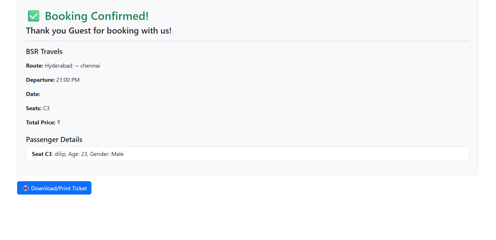

# 🚌 RedBus Clone - MERN Stack Project

A full-stack RedBus clone built with the MERN (MongoDB, Express.js, React.js, Node.js) stack. Users can sign up, log in, search for buses, select seats, enter passenger details, and confirm bookings with a downloadable ticket.

## 🚀 Features

- ✅ User Authentication (Signup/Login/Logout)
- 🎫 Seat Selection with Local & DB Support
- 📅 Bus Route, Date & Time Display
- 🧑 Passenger Details Form
- 💾 MongoDB Integration to Save Bookings
- 🖨️ Downloadable/Printable Ticket
- 🔒 AuthContext for Global State Management
- 🌐 Responsive UI with Bootstrap

## 🛠️ Tech Stack

**Frontend**  
- React.js (Vite)
- React Router
- Bootstrap 5
- AuthContext API

**Backend**  
- Node.js
- Express.js
- MongoDB with Mongoose
- Bcrypt for password hashing
- CORS for secure API calls

## 📂 Folder Structure

redbus-clone/
│
├── backend/
│ ├── models/ # Mongoose models
│ ├── routes/ # Auth & Booking routes
│ └── server.js # Express app entry point
│
├── src/
│ ├── components/ # Header, SeatSelector, etc.
│ ├── context/ # AuthContext for global state
│ ├── pages/ # Login, Signup, BookingConfirmation
│ ├── data/ # Sample bus data
│ └── App.jsx # Main app with routing
│
├── .env # Environment variables (e.g., MONGO_URI)
├── package.json # Project metadata

## 🌐 Running the App Locally

### 🔧 Backend

```bash
cd backend
npm install
# Add .env file with your MongoDB URI
MONGO_URI=your_mongo_uri
node server.js
```
 ### 💻 Frontend
 ```bash
 cd redbus-clone
npm install
npm run dev
```
App runs at: http://localhost:5000 (Vite frontend)
API runs at: http://localhost:5001 or your backend port

### 📸 Screenshots




### 📌 Future Enhancements
- Payment gateway integration

- Admin panel for adding buses

- OTP/email verification

- Filter by time, price, rating

### 🙌 Author
Made with ❤️ by Bethu Dilip Chandu

